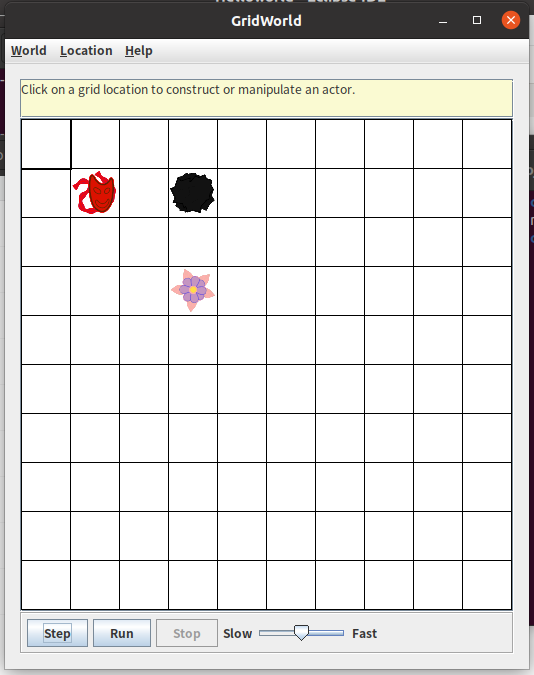
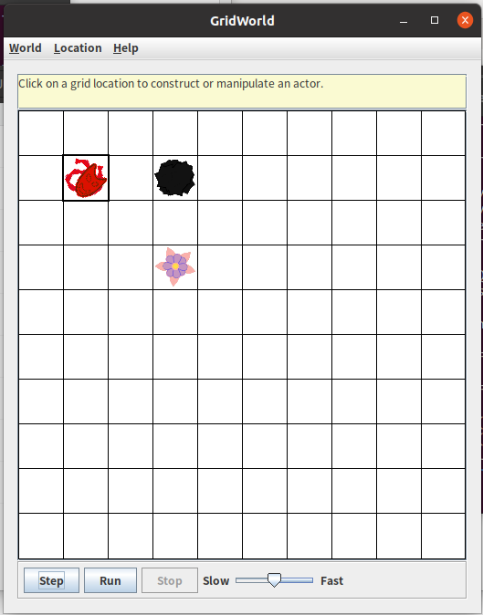
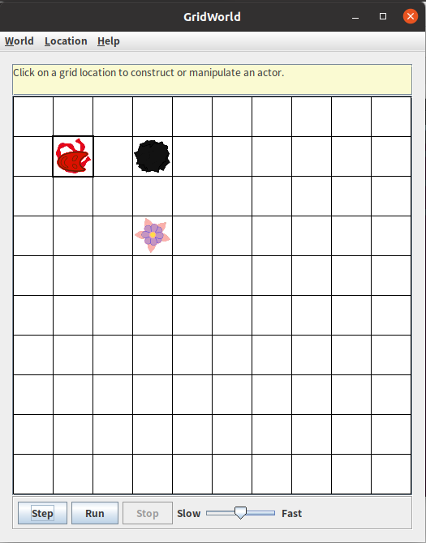
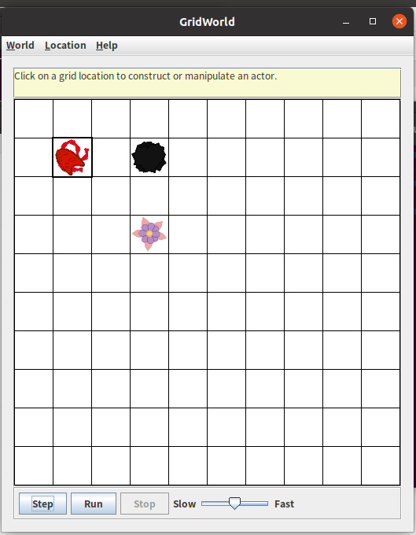
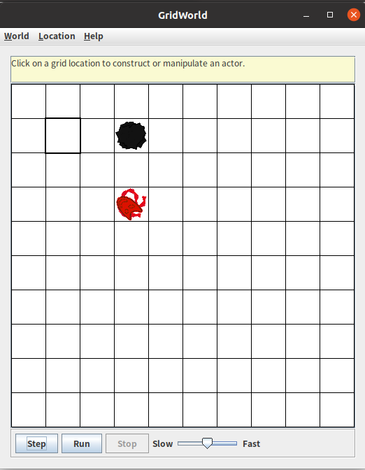
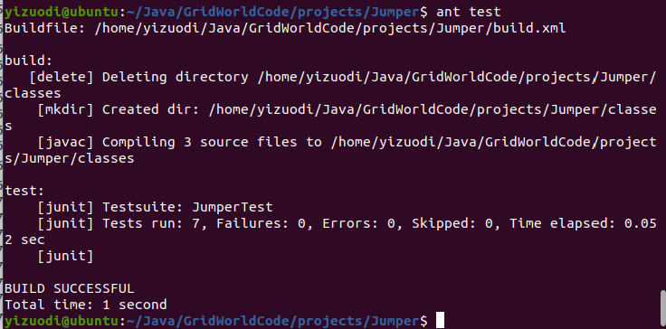
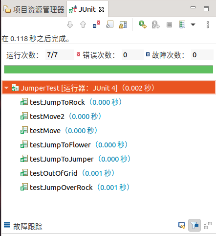

# 阶段2Part 3 Jumper测试文档

## 运行JumperRunner测试效果

首先，我们能正常运行：

由于其下一跳的位置在grid之外，所以它会先转向两次（第一次转向后下一跳位置仍在grid之外）。此时，下一跳的位置上有一个Rock，所以它会继续转向。此时，它下一跳的位置上有一个Flower，可以跳到，所以Jumper会跳到这个位置（并“吃”掉花），这些表现和我们的预期是一致的（参考下面的图，顺序为从左到右，从上到下）。

|  |  |
| ----------------------------- | ----------------------------- |
|  |  |

## 使用Junit进行单元测试

我们编写了单元测试文件`JumperTest.java`，包含下列7项测试：

`testMove`——测试Jumper是否能正常移动2格（没有障碍物）

`testMove2`——测试Jumper是否能正常移动2格（没有障碍物，东南方向）

`testJumpToRock`——测试jumper是否能跳到一个Rock上

`testJumpToFlower`——测试Jumper是否能跳到一个Flower上

`testOutOfGrid`——测试Jumper是否能跳到一个越界位置

`testJumpOverRock`——测试Jumper是否能跳过一个石头

`testJumpToJumper`——测试Jumper是否能跳到一个Jumper上

在命令行下进行单元测试：

在Eclipse中使用JUnit 4对Jumper类进行单元测试：

## 使用Sonar进行代码分析评估

分析评估结果如下：

可见满足实训文档中对代码的基本标准。
