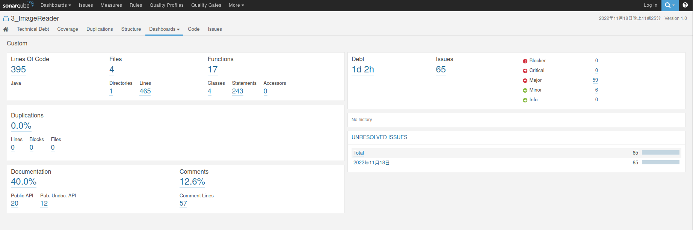

# ImageReader

## 说明

`ImplementImageIO.java, ImplementImageProcessor.java, ImageProcessorTest.java`文件置于src目录下。

## 编译

在src目录，终端中键入：

```
javac -cp .:./../ImageReader.jar ImplementImageIO.java ImplementImageProcessor.java ImageReaderRunner.java
```

## 运行

在src目录，终端中键入：

```
java -cp .:./../ImageReader.jar ImageReaderRunner
```

## Junit测试

在本项目根目录（当前目录）下，终端中键入：

`ant test`

## SonarQube评测

请在src目录下运行`sonar-runner`进行代码评测。

参考评测结果：

