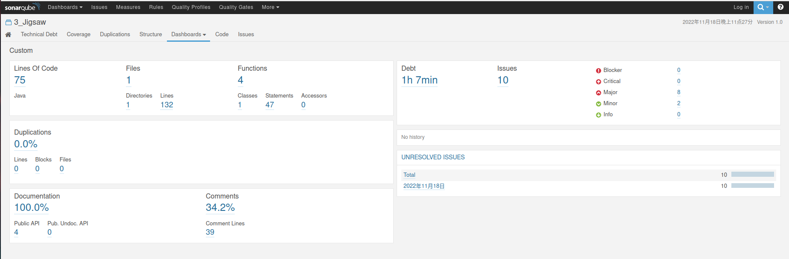

# Jigsaw

## 说明

`Solution.java`文件置于src目录下。

## 编译

在`run`目录，终端中键入：

```
mkdir -p build && javac -encoding UTF-8 -d build -cp src src/Runners/*.java
```

## 运行

在`run`目录，终端中键入：

（演示程序）

```
java -cp build Runners.RunnerDemo
```

或：

（实验任务一）

```
java -cp build Runners.RunnerPart1
```

或：

（实验任务二）

```
java -cp build Runners.RunnerPart2
```


## tesh.sh测试

在`run`目录，终端中键入：

```
chmod +x test.sh && ./test.sh
```

或：

```
javac -encoding UTF-8 -d build -cp lib/jigsaw.jar src/solution/Solution.java
java -cp lib/jigsaw.jar:build judge.main
```


## SonarQube评测

请在src目录下运行`sonar-runner`进行代码评测。

参考评测结果：


