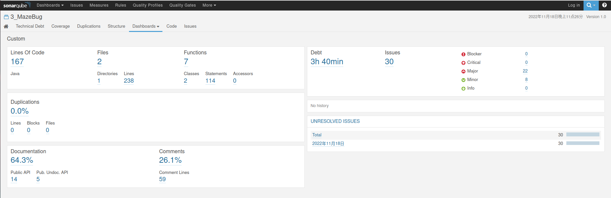

# MazeBug

## 说明

`MazeBug.java`文件置于src目录下。

## 打包

请在run目录下进行如下操作：

1. 将我们的MazeBug.java文件放置于`framework/info/gridworld/maze`路径下。

2. 在run目录下打开命令行，执行`ant`，生成的新的`gridworld.jar`文件。新生成的在`dist/GridWorldCode`路径下，我们将其复制替换原有的`gridworld.jar`，参考命令语句如下：

   `cd dist/GridWorldCode/ && cp gridworld.jar ../.. && cd ../..`

## 编译与运行

在`run/projects/MazeBug`目录，终端中键入：

```
javac -cp .:./../../gridworld.jar MazeBugRunner.java && java -cp .:./../../gridworld.jar MazeBugRunner
```

## SonarQube评测

请在src目录下运行`sonar-runner`进行代码评测。

参考评测结果：


